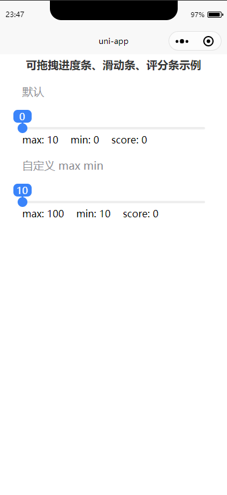
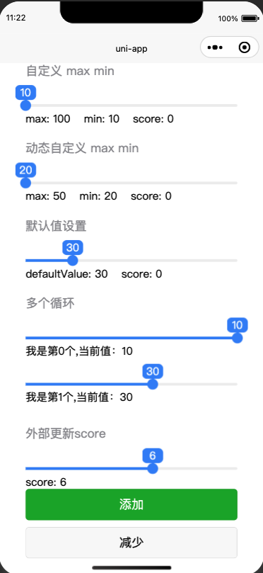
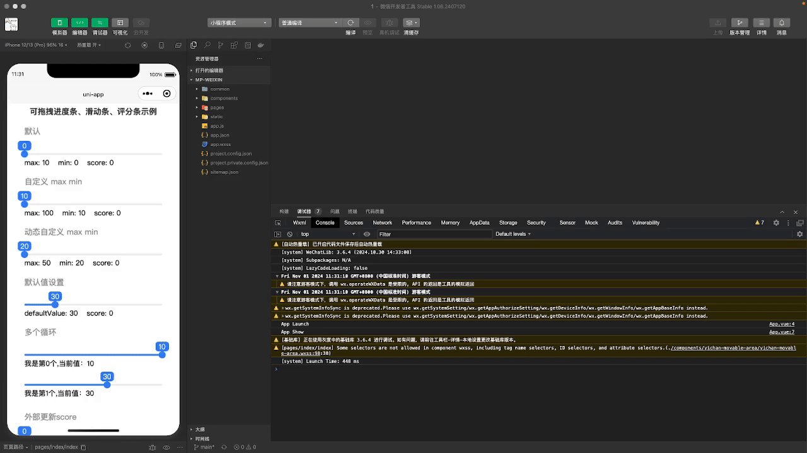

## 可拖拽进度条、滑动条、评分条、movable-area

### 简介

- 使用 [movable-area](https://developers.weixin.qq.com/miniprogram/dev/component/movable-area.html) 实现可拖拽进度条、滑动条、评分条

- 具体使用可以跳转至 [uniapp插件地址](https://ext.dcloud.net.cn/plugin?id=6274) 查看

### Example
```
<template>
	<view>
		<yichan-movable-area />
	</view>
</template>
<script>
	import YiChanMovableArea from '../../components/yichan-movable-area/yichan-movable-area.vue';
	export default {
		components: {
			YiChanMovableArea
		},
	}
</script>

```
### Props
|  属性名  | 类型 | 说明 | 默认值 |
|  :----:  | :----:  | :----: | :----: |
| min  | Number | 最小值 | 0 |
| max  | Number | 最大值 | 0 |
| defaultValue  | Number | 默认值 | 0 |
| disabled  | Boolean | 是否禁用拖拽 | false |
| delay  | Number | 进度条动画时间(单位s) | 0 |
### Events
|  函数名  | 参数 | 返回值 | 说明 |
| :----:  | :----: | :----: | :----: |
| change  | 无 | 返回当前选择的数值 | 拖拽时触发 |
| updateScore  | score(Number或者 String) | 无 | 更新组件 score |


<!-- 发布时需要 将  components 文件夹复制到 release/yichan-movable-area 下，然后 将 yichan-movable-area 打包 上传即可 -->



